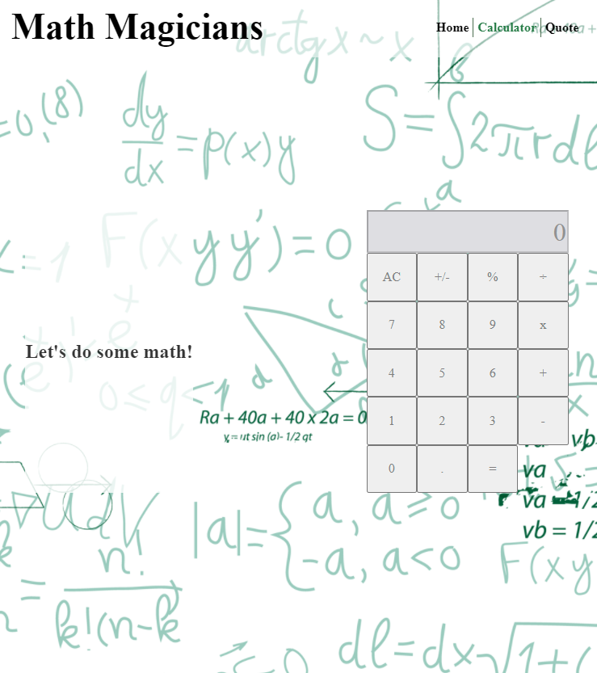

# Math Magician

Main goal of this milestone was working with React components and events creating SPA.

## Built With

- HTML
- SASS
- JS
- React

### Live version

- live: [Github](https://iwillteixeira.github.io/math-magicians/)
- live: [Heroku](https://math-will-microverse.herokuapp.com/)
- live: [Netlify](https://math-will-microverse.herokuapp.com/)

## Getting Started

To get a local copy up and running follow these simple example steps:

1- Click on the top right green code button.
2- On the dropdown menu, choose download zip button.
3- After download, extract the zip file and you have the project running on your machine.
4- You can also clone the project using git clone command.
5- After downloading or cloning the project use the command git i to install all Node packages.

### Prerequisites

To contribute with this project you must instal the follow items:

- NODE
- NPM
- SASS
- REACT

### Setup

Dowload NPM and NODE

### Install

Install the packages globally and after that:

`npm install`

### Run tests

- `npm run fixlinters` fix and look up for errors
- `npm run test` jest test

## Authors

👤 **Will Teixeira**

- GitHub: [@githubhandle](https://github.com/iwillteixeira)
- Twitter: [@twitterhandle](https://twitter.com/iwillteixeira)
- LinkedIn: [LinkedIn](https://www.linkedin.com/in/juscelinodev/)

## 🤝 Contributing

Contributions, issues, and feature requests are welcome!

Feel free to check the [issues page](../../issues/).

## Show your support

Give a ⭐️ if you like this project!

## Acknowledgments

- [Microverse](https://www.microverse.com)
- [FreeCodeCamp](https://www.freecodecamp.com)